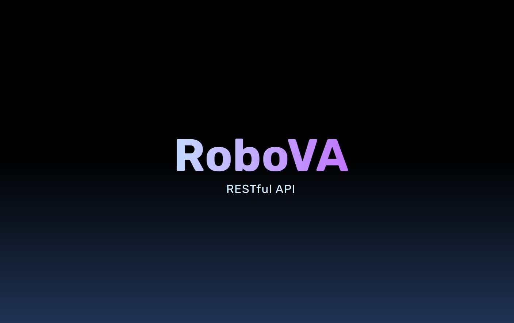

# RoboVA - Virtual Assistant Business RESTful API

    

## Introduction

RoboVa is a RESTful API server for a small virtual assistant business to assist the business owner in keeping track of employees, clients, and tasks.

## MVC Pattern

This project follows a Model-View-Controller software architectural pattern. The model represents the data, the view represents the presentation layer, and the controller handles the requests and responses. This structure makes it easier to maintain and extend the codebase, as each component has a clear responsibility.

## CRUD Operations

### Users

- GET all users
- GET user by id
- PATCH existing user
- POST new user
- DELETE user

### Tasks

- GET all tasks
- GET task by id
- PATCH existing task (assign/edit a user, customer, status, etc.)
- DELETE task

### Clients

- GET all clients
- GET client by id
- PATCH existing client
- POST new client
- DELETE client

### Auth

- POST Login
- GET Refresh Token
- POST Logout

## Middleware

Custom middleware has been created to perform the following:

- Handle errors
- Log request errors and database errors within a .log file.
- Log delete request methods within a .log file.
- Limit the number of login attempts per IP address window.
- Verify json web token on authorized routes.

## Error and Delete Request Logs

Logs request errors, database errors and all DELETE requests performed each within a respective .log file. The error logs help with debugging and monitoring the application. The delete log provides an audit trail of changes made to the data.

## Security

- Uses Bcrypt to hash and verify user passwords that are stored within the MongoDB database.
- Uses Json Web Tokens with secrets for login route and refresh route.
- Refresh tokens cannot be refreshed and are stored within an httpOnly cookie.
- Tokens/cookies are cleared upon logout.

## Stack

HTML
JavaScript
Node.js / Express
MongoDB / Mongoose
JsonWebTokens
Bcrypt

## Usage

Suggestions, forks and pull requests are always welcome. Please give the project a star on GitLab if you are using the project.

## License

MIT License

Copyright (c) [2022] [Sarah Salvatore]

Permission is hereby granted, free of charge, to any person obtaining a copy of this software and associated documentation files (the "Software"), to deal in the Software without restriction, including without limitation the rights to use, copy, modify, merge, publish, distribute, sublicense, and/or sell copies of the Software, and to permit persons to whom the Software is furnished to do so, subject to the following conditions:

The above copyright notice and this permission notice shall be included in all copies or substantial portions of the Software.

THE SOFTWARE IS PROVIDED "AS IS", WITHOUT WARRANTY OF ANY KIND, EXPRESS OR IMPLIED, INCLUDING BUT NOT LIMITED TO THE WARRANTIES OF MERCHANTABILITY, FITNESS FOR A PARTICULAR PURPOSE AND NONINFRINGEMENT. IN NO EVENT SHALL THE AUTHORS OR COPYRIGHT HOLDERS BE LIABLE FOR ANY CLAIM, DAMAGES OR OTHER LIABILITY, WHETHER IN AN ACTION OF CONTRACT, TORT OR OTHERWISE, ARISING FROM, OUT OF OR IN CONNECTION WITH THE SOFTWARE OR THE USE OR OTHER DEALINGS IN THE SOFTWARE.

## Created By

Sarah Salvatore

email: sarah.h.salvatore@gmail.com
linkedin: [Sarah Salvatore](https://www.linkedin.com/in/sarah-salvatore-full-stack-developer/)
